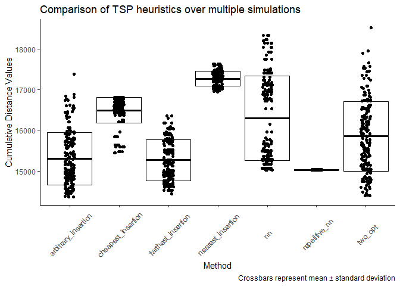

### Introduction

The traveling salesman problem (TSP) is an NP-hard combinatorial
optimization problem that can be applied to different fields studying
networks. In addition to exact algorithms that calculate the most
optimal route through a set of locations, several heuristics have been
developed to approximate solutions.

Authors Michael Hahsler and Kurt Hornik developed the TSP R package
which provides the infrastructure for solving the traveling salesperson
problem using a variety of methods including *Concorde*, one of the best
exact TSP solvers. In this report, I apply a Monte Carlo approach to
solve a TSP example using the available heuristics for solving
asymmetric TSPs. Through this application, I hope 1) to increase the
chances of determining an optimal route using a heuristic to solve the
problem and 2) to compare different heuristic methods in their
performance. In this version, these heuristics will not be compared to
an exact method such as *Concorde*, so the performance of this Monte
Carlo approach will not be graded against an exact algorithm. In the
future, I hope to add this.

### Identifying the Problem

I will be using the USCA50 dataset included with the TSP R package which
contains the distances between 50 US cities as is already coded as an
object of class ‘TSP’. To note, any distance matrix can be converted to
class TSP.

    data("USCA50")
    dat <- USCA50
    n_of_cities(dat)

    ## [1] 50

    head(labels(dat))

    ## [1] "Abilene, TX"     "Akron, OH"       "Albany, NY"      "Albuquerque, NM"
    ## [5] "Alert, NT"       "Allentown, PA"

The original authors compare the performance of their included
heuristics in the original vignette, but given that these methods
approximate, the same method will not give the same output each time it
is called.

    solve_TSP(dat, method = "nn")

    ## object of class 'TOUR' 
    ## result of method 'nn' for 50 cities
    ## tour length: 15208

    solve_TSP(dat, method = "nn")

    ## object of class 'TOUR' 
    ## result of method 'nn' for 50 cities
    ## tour length: 17598

This is true even if using the set.seed() function which can return
consistent outputs for other R functions that rely on randomization such
as rnorm(), sample(), etc.

    set.seed(123)
    solve_TSP(dat, method = "nn")

    ## object of class 'TOUR' 
    ## result of method 'nn' for 50 cities
    ## tour length: 16568

    solve_TSP(dat, method = "nn")

    ## object of class 'TOUR' 
    ## result of method 'nn' for 50 cities
    ## tour length: 18070

Thus, repeated use of these methods using this R package will not yield
consistent results. Moreover, it may not yield consistently **good**
results.

### Application of the Monte Carlo method

The Monte Carlo method is a broad class of algorithmic approaches to
mathematical problems that rely on random sampling. In science, it can
often be used to simulate statistical outcomes of experiments and
determine the sample sizes needed to have sufficient experimental power
at a given false positive threshold.

Here, I use a Monte Carlo method to simulate the TSP heuristics for a
determined number of simulations to select the best performance and its
associated route. I imagined a scenario where I needed to find a
Hamiltonian cycle (the route in which each city is only visited once)
for the 50 cities in the USCA50 dataset. Being from Atlanta, I wanted to
start my route from Atlanta, GA and end in Augusta, GA in order to have
a relatively short drive back home at the end of my journey.

    dat <- USCA50
    m <- as.matrix(dat) #take the data from USCA50 and convert to matrix format

    #Identify my cities of interest (ie my starting and ending points)
    atl <- which(labels(dat) == "Atlanta, GA")
    aug <- which(labels(dat) == "Augusta, GA")

    atsp <- ATSP(m[-c(atl, aug), -c(atl, aug)]) #Regenerate the TSP object without the entries for the distance between Atlanta, GA and Augusta, GA
    atsp <- insert_dummy(atsp, label = "ATL/AUG") #I insert a 'dummy' city in leiu of Atlanta and Augusta
    atl_aug <- which(labels(atsp) == "ATL/AUG") #Apply the 'dummy' name to this object name atl_aug which will serve as 'dummy' object

    atsp[atl_aug, ] <- c(m[-c(atl, aug), atl], 0) #Assign the values of the original dat matrix for Atlanta to the position in the new TSP object followed by 0
    atsp[, atl_aug] <- c(m[aug, -c(atl, aug)], 0) #Assign the values of the original dat matrix for Augusta to the position in the new TSP object followed by 0

    tail(as.matrix(atsp), 2)

    ##                   Abilene, TX Akron, OH Albany, NY Albuquerque, NM Alert, NT
    ## Central Islip, NY        1572       434        131            1853      2893
    ## ATL/AUG                   891       530        842            1269      3411
    ##                   Allentown, PA Amarillo, TX Anchorage, AK Ann Arbor, MI
    ## Central Islip, NY           120         1597          3383           553
    ## ATL/AUG                     680          997          3402           589
    ##                   Asheville, NC Ashland, KY Atlantic City, NJ Augusta, ME
    ## Central Islip, NY           621         526               117         299
    ## ATL/AUG                     165         341               674        1068
    ##                   Austin, TX Bakersfield, CA Baltimore, MD Bangor, ME
    ## Central Islip, NY       1552            2491           208        356
    ## ATL/AUG                  817            1963           576       1127
    ##                   Baton Rouge, LA Battle Creek, MI Bay City, MI Beaumont, TX
    ## Central Islip, NY            1231              627          579         1384
    ## ATL/AUG                       456              593          680          623
    ##                   Belleville, ON Bellingham, WA Berkeley, CA Billings, MT
    ## Central Islip, NY            314           2434         2595         1793
    ## ATL/AUG                      814           2203         2127         1517
    ##                   Biloxi, MS Binghamtom, NY Birmingham, AL Bismarck, ND
    ## Central Islip, NY       1133            167            900         1428
    ## ATL/AUG                  350            738            139         1244
    ##                   Bloomington, IL Boise, ID Boston, MA Bowling Green, KY
    ## Central Islip, NY             827      2184        154               758
    ## ATL/AUG                       529      1832        935               252
    ##                   Brandon, MB Brantford, ON Brattleboro, VT Bridgeport, CT
    ## Central Islip, NY        1433           400             146             25
    ## ATL/AUG                  1368           684             896            798
    ##                   Brockton, MA Buffalo, NY Burlington, ONT Burlington, VT
    ## Central Islip, NY          144         326             386            254
    ## ATL/AUG                    926         698             712            951
    ##                   Butte, MT Calgary, AB Cambridge, MA Canton, OH
    ## Central Islip, NY      1986        2055           154        427
    ## ATL/AUG                1702        1907           934        514
    ##                   Carson City, NV Cedar Rapids, IA Central Islip, NY ATL/AUG
    ## Central Islip, NY            2438              957                 0     698
    ## ATL/AUG                      1988              693               783       0

This ‘dummy’ will be excised using the cut\_tour() function in TSP to
place Atlanta and Augusta as my start and end points.

    nsims = 200
    methods <- c("nearest_insertion", "farthest_insertion", "cheapest_insertion", "arbitrary_insertion", "nn", "repetitive_nn", "two_opt")
    start = "Atlanta, GA"
    finish = "Augusta, GA"
    dummy = atl_aug #Use name of dummy object that was assigned above

    mc.tsp <- function(tsp, nsims, methods, begin, finish, dummy) {
      
      
      l <- list()
      tlength <- data.frame()
      p <- c()
      pname <- c()
      path <- list()
      path2 <- data.frame()
      
      for (i in methods) { #For each method

          for (j in c(1:nsims)) { #Simulate up to the number of sims
        
            s <- solve_TSP(tsp, method = i)
            tlength[j,i] <- attributes(s)[3] #Pulls tour length
            
            path[[i]][j] = list(c(start, #Pulls the associated path
                  labels(cut_tour(s, dummy)),
                  finish))
            
          }
        }
        
        best_length = tlength %>% rownames_to_column(var = "iteration") %>% #Filters for the minimum tour length (ie the best performance)
          pivot_longer(cols = -iteration, names_to = "method", values_to = "value") %>% 
          group_by(method) %>% filter(value == min(value)) %>%
          group_by(method) %>% distinct(value, .keep_all = T) %>% 
          mutate(id = str_c(method, iteration, sep = ""))
        
        best <- list()
        best[[1]] <- best_length
        best[[2]] <- as.data.frame(unlist(path, F, T)) %>% #Pulls the tour path associated with the iteration containing the best performance
          pivot_longer(everything(), names_to = "id", values_to = "value") %>%   
          filter(id %in% best_length$id) %>% arrange(id)
        best[[3]] <- tlength %>% rownames_to_column(var = "iteration") %>% #Collects all of the simulation data in a tidy long format
          pivot_longer(cols = -iteration, names_to = "method", values_to = "value")
        
        names(best) <- c("Best Performance Distances", "Most optimal routes generated", "Full Distance Data")
        
        return(best)
    }

    tst <- mc.tsp(atsp, nsims, methods, start, finish, dummy)

    #What have we got?

    names(tst)

    ## [1] "Best Performance Distances"    "Most optimal routes generated"
    ## [3] "Full Distance Data"

    tst$`Best Performance Distances` %>% arrange(value)

    ## # A tibble: 7 x 4
    ## # Groups:   method [7]
    ##   iteration method              value id                   
    ##   <chr>     <chr>               <dbl> <chr>                
    ## 1 99        arbitrary_insertion 14362 arbitrary_insertion99
    ## 2 141       two_opt             14392 two_opt141           
    ## 3 81        farthest_insertion  14437 farthest_insertion81 
    ## 4 1         repetitive_nn       15027 repetitive_nn1       
    ## 5 84        nn                  15027 nn84                 
    ## 6 6         cheapest_insertion  15445 cheapest_insertion6  
    ## 7 197       nearest_insertion   16942 nearest_insertion197

    head(tst$`Most optimal routes generated`)

    ## # A tibble: 6 x 2
    ##   id                    value          
    ##   <chr>                 <chr>          
    ## 1 arbitrary_insertion99 Atlanta, GA    
    ## 2 arbitrary_insertion99 Birmingham, AL 
    ## 3 arbitrary_insertion99 Biloxi, MS     
    ## 4 arbitrary_insertion99 Baton Rouge, LA
    ## 5 arbitrary_insertion99 Beaumont, TX   
    ## 6 arbitrary_insertion99 Austin, TX

    head(tst$`Full Distance Data`)

    ## # A tibble: 6 x 3
    ##   iteration method              value
    ##   <chr>     <chr>               <dbl>
    ## 1 1         nearest_insertion   17071
    ## 2 1         farthest_insertion  15009
    ## 3 1         cheapest_insertion  16463
    ## 4 1         arbitrary_insertion 15410
    ## 5 1         nn                  15450
    ## 6 1         repetitive_nn       15027

### Analyze the Outcome

Now, let’s take a look at the route on a map. The dataset USCA312\_GPS
has the latitude and longitude coordinates of 312 cities on the North
American continent, including the 50 in the analysis.

    data("USCA312_GPS")
    loc <- USCA312_GPS
    loc50 <- loc %>% filter(name %in% tst$`Most optimal routes generated`$value)

    #apply(loc50[,1:2], 2, range) #for the mapping parameters

    index <- function(vec) { #Function to return index ids that repeat like 1, 1, 2, 2, 3, 3, ..., n-1, n-1, n for number of nodes (n).
      v <- c()
      v[1] <- 1
      v[2] <- 1
      for (i in c(vec)) {
        v[i+i+1] <- 1+i
        v[i+i+2] <- 1+i
      }
      v <- v[-c(length(v)-1, length(v))]
      return(v)
    }

    best <- tst$`Best Performance Distances` %>% ungroup() %>% filter(value <= min(value)) %>% select(id) %>% pluck(., 1)

    route <- tst$`Most optimal routes generated` %>% 
      filter(id == best) %>% #input our best performing method and iteration from the output above
      mutate(n = c(1:nrow(.))) %>%  rbind(., .) %>% arrange(n) %>% 
      slice(-1, -n()) %>% #Remove the second instance of Atlanta and Augusta
      mutate(index = index(1:(nrow(.)/2))) %>% 
      select(name = value, index) %>% 
      full_join(loc50)

    head(route)

    ## # A tibble: 6 x 4
    ##   name            index  long   lat
    ##   <chr>           <dbl> <dbl> <dbl>
    ## 1 Atlanta, GA         1 -84.4  33.7
    ## 2 Birmingham, AL      1 -86.8  33.5
    ## 3 Birmingham, AL      2 -86.8  33.5
    ## 4 Biloxi, MS          2 -88.9  30.4
    ## 5 Biloxi, MS          3 -88.9  30.4
    ## 6 Baton Rouge, LA     3 -91.2  30.5

    world <- ne_countries(scale = "medium", returnclass = "sf")
    ggplot(data = world)+
      geom_sf()+
      xlab("Longitude")+ylab("Latitude")+
      coord_sf(xlim = c(-160, -60), ylim = c(25, 85), expand = F)+
      geom_point(data = loc50, aes(x = long, y = lat), color = "red", alpha = 0.5)+
      geom_point(data = subset(route, subset = name == "Atlanta, GA" | name == "Augusta, GA"), 
                 aes(x = long, y = lat, color = name))+
      geom_line(data = route, aes(x = long, y = lat, group = index))+
      scale_color_manual(values = c("Green", "Yellow"))+
      theme(legend.position = "none")+
      ggtitle("Optimal Route through 50 cities using Arbitrary Insertion 
    Algorithm")+
      labs(caption = "Starting in Atlanta, GA (Green) and finishing in Augusta, GA (Yellow)")

What if we compare the routes of different algorithms?

    worst <- tst$`Best Performance Distances` %>% ungroup() %>% filter(value == max(value)) %>% select(id) %>% pluck(., 1)

    route2 <- tst$`Most optimal routes generated` %>% 
      filter(id == worst) %>% #input our best performing method and iteration from the output above
      mutate(n = c(1:nrow(.))) %>%  rbind(., .) %>% arrange(n) %>% 
      slice(-1, -n()) %>% #Remove the second instance of Atlanta and Augusta
      mutate(index = index(1:(nrow(.)/2))) %>% 
      select(name = value, index) %>% 
      full_join(loc50)

    ggplot(data = world)+
      geom_sf()+
      xlab("Longitude")+ylab("Latitude")+
      coord_sf(xlim = c(-160, -60), ylim = c(25, 85), expand = F)+
      geom_point(data = loc50, aes(x = long, y = lat), alpha = 0.5)+
      geom_point(data = subset(route, subset = name == "Atlanta, GA" | name == "Augusta, GA"), 
                 aes(x = long, y = lat, color = name))+
      geom_line(data = route, aes(x = long, y = lat, group = index), color = "Red")+
      geom_line(data = route2, aes(x = long, y = lat, group = index), color = "Blue", alpha = 0.7)+
      scale_color_manual(values = c("Green", "Yellow"))+
      theme(legend.position = "none")+
      ggtitle("Comparison of Arbitrary Insertion Heuristic (best; red) vs.
    Nearest Insertion Heursitic (worst; blue)")+
      labs(caption = "Starting in Atlanta, GA (Green) and finishing in Augusta, GA (Yellow)")

Interestingly, the latter half of each of these routes is very similar,
focusing on the NE U.S. states after coming down from Nunavut, Canada,
suggesting that the early decisions constituted the difference in
distances.

When simulating this example, the Arbitrary Insertion heuristic will
outperform the others consistently in finding the shortest route.
However, a more complete comparison between these methods is needed.
Using the “Full Distance Data” object from the mc.tsp() function, I can
assess the variance in the performances of each method and more
accurately compare them.

    perf <- tst$`Full Distance Data`

    ggplot(perf, aes(method, value))+
      geom_point(position = position_jitter(width = 0.1))+
      stat_summary(geom = "crossbar",
                   fun.data = "mean_sdl",
                   fun.args = list(mult=1))+
      theme_classic()+
      theme(axis.text.x = element_text(angle = 45, vjust = 0.5))+
      xlab("Method") + ylab("Cumulative Distance Values")+
      ggtitle("Comparison of TSP heuristics over multiple simulations")+
      labs(caption = "Crossbars represent mean ± standard deviation")

From this plot, we can assess the variance and any skewedness of the
methods. There are some interesting findings. For example, while
arbitrary insertion will consistently perform the best, it has a
relatively high variance compared to farthest insertion. Thus, depending
on the number of simulations one is able to run, farthest insertion may
provide better results. The two opt method also has a high variance
(higher than arbitrary insertion) but is able to yield some of the
lowest distances. Cheapest insertion is not normally distributed showing
a strong cluster of outcomes right around the mean and a few that drop
well below two standard deviations.

Interestingly, nearest neighbors has what appears to be a bimodal
distribution of outcomes with a lack of values clustered around its
mean. Moreover, its best performance aligns with the performance of
repetitive nearest neighbors suggesting that it cannot outperform the
repetitive nearest neighbors approach but only match it. Interestingly,
repetitive nearest neighbors yields the same value each time it is used.

    ggplot(perf, aes(as.integer(iteration), value, group = method, color = method))+
      geom_point()+
      geom_line()+
      facet_wrap(~method)+
      theme_bw()+
      ggtitle("There is no stepwise improvement of heuristic performance over the iterations")+
      xlab("Iteration") + ylab("Cumulative Distance Values")

These heuristics do not appear to improve their performance over
successive iterations. Logically, this makes sense as there is no reward
function that was implemented. Instead, each heuristic was just run
repeatedly and the unbiased best performance can be selected from the
outcomes.

### Conclusion

TSP heuristics can be computationally cheap and fast methods to solve
TSP problems with a low to moderate number of locations. Here, I apply a
Monte Carlo approach to iterate TSP heuristics and select the best
performance from among them. This method can be used to compare the best
performances across several TSP heuristics and can generate an optimal
route.

This method can be used with any number of cities and with any
starting/ending points. While I did not provide an example, any
locations for which a distance matrix can be generated and geographic
coordinates can be determined are suitable.

One limitation is these data use straight line distances between cities
and does not account for actual road distance or other factors such as
incline, etc. To note, this method could be applied to more
sophisticated distance data such as that from the ggmap package. This
would allow for the generation of distance matrices based on actual road
distance or on other factors such as average travel time. Another
limitation is the lack of the *Concorde* method in this report. Future
versions of this report will compare these heuristics to the *Concorde*
method as a way to determine the absolute performance of these
heuristics compared to an exact algorithm.

### References

<a href="https://en.wikipedia.org/wiki/Travelling_salesman_problem#As_a_graph_problem" class="uri">https://en.wikipedia.org/wiki/Travelling_salesman_problem#As_a_graph_problem</a>

<a href="https://en.wikipedia.org/wiki/Monte_Carlo_method" class="uri">https://en.wikipedia.org/wiki/Monte_Carlo_method</a>

Hahsler M, Hornik K (2007). “TSP - Infrastructure for the traveling
salesperson problem.” *Journal of Statistical Software*, *23*(2), 1-21.
ISSN 1548-7660, doi: 10.18637/jss.v023.i02 (URL:
<a href="https://doi.org/10.18637/jss.v023.i02" class="uri">https://doi.org/10.18637/jss.v023.i02</a>),
&lt;URL:
<a href="http://www.jstatsoft.org/v23/i02/" class="uri">http://www.jstatsoft.org/v23/i02/</a>&gt;.

<a href="https://github.com/dkahle/ggmap" class="uri">https://github.com/dkahle/ggmap</a>
